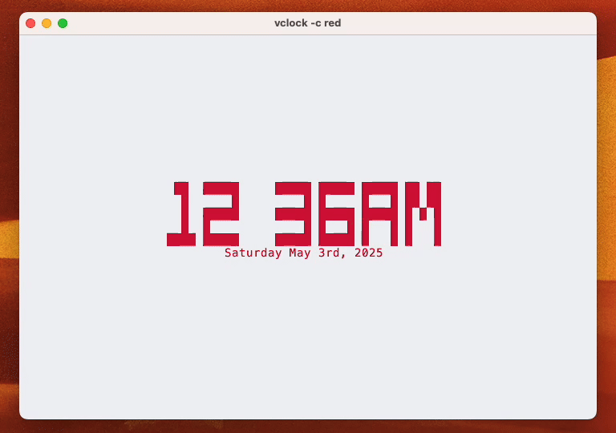

# vclock ⏰

Colorful, resize-aware, ASCII-art clock for your terminal &mdash; written in [V](https://vlang.io).



*Works on Linux, macOS, and any ANSI-capable terminal.*

---

## Features

- Large block-glyph digits rendered with pure text
- Optional seconds, blinking colon, and date line
- Six ANSI colors or plain monochrome
- Smart refesh interval (500 ms / 1 s / 1 min)
- Window-resize aware; can be centered or left-aligned
- Zero runtime dependencies other than the V standard library

---

## Installation

```bash
git clone https://github.com/patflynn90/vclock.git
cd vclock
v -prod .
./vclock
```

Only tested with V ≥ 0.4.10.

---

## Usage

```bash
vclock [flags]
```

| Flag         | Short | Default | Description                                                                     |
|--------------|-------|---------|---------------------------------------------------------------------------------|
| `--color`    | `-c`  | none    | digit color (valid values: `blue`, `cyan`, `green`, `magenta`, `red`, `yellow`) |
| `--nocenter` |       | off     | print at top-left instead of centering                                          |
| `--nodate`   | `-d`  | off     | hide the date line                                                              |
| `--noblink`  | `-b`  | off     | disable blinking colon                                                          |
| `--seconds`  | `-s`  | off     | show seconds (`hh:mm:ss`)                                                       |
| `--24h`      | `-H`  | off     | enable 24-hour clock format (instead of 12-hour AM/PM)                          |

Examples:

```bash
# Big cyan clock with seconds, centered
vclock -c cyan --seconds

# Plain left-aligned HH:MM updated once per minute
vclock --nocenter --noblink --nodate
```

Press **Ctrl-C** to quit; the program restores your cursor and echo mode automatically. Terminal state is properly managed even when stdin is redirected, ensuring a clean exit under various conditions.

## Examples

```bash
# Big cyan clock with seconds in 24-hour format
vclock -c cyan --seconds --24h

# Standard 12-hour clock with AM/PM indicator
vclock

# Date display with yellow coloring
vclock -c yellow

# Plain left-aligned 24-hour format updated once per minute
vclock --nocenter --noblink --nodate --24h
```
